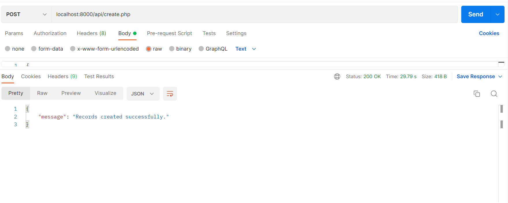
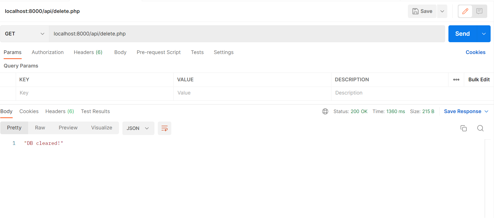
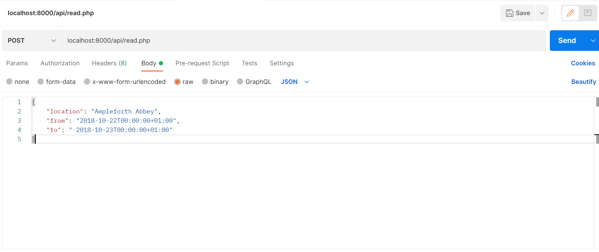
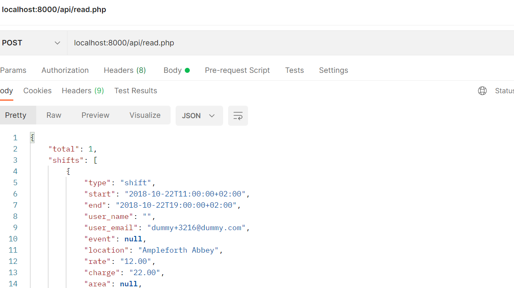

## PARim Home Task

A simple api task for PARim Solutions using PHP 7+, MySQL 8


## :triangular_flag_on_post: Table of Contents

- [Installation](#installation)
- [Folder Structure](#folder)
- [API routes](#api)
- [Improvements](#improvements)
- [Comments](#comments)
- [Author](#author)
- [License](#license)

## Installation :computer:
Follow these steps:

### 1. Clone the project 

```bash
git clone git@github.com:ashfaqshuvo007/php-mysql-rest-api-2022.git
```
### 2. DB Setup (MySQL) 
- login to MySQL
Open your terminal and type the following command
```bash
mysql -u root -p
```
Enter your **password** when prompted.

- Create a new Database. Replace **dbname** with your database name.
```bash
CREATE DATABASE dbname;
```
- Create a new User
```bash
CREATE USER 'username' IDENTIFIED BY 'password';
```
- Grant all privileges to the user for the new database
```bash
GRANT ALL PRIVILEGES on DATABASE dbname to username;
```
- Create tables with following schema. The schema is given in **schema.sql** file. 

```bash
CREATE TABLE IF NOT EXISTS `Users` (
  `id` int(11) NOT NULL AUTO_INCREMENT,
  `name` varchar(256) NULL,
  `email` varchar(50) UNIQUE NOT NULL,
  `created` datetime NOT NULL,
  PRIMARY KEY (`id`)
)ENGINE=InnoDB  DEFAULT CHARSET=utf8;
```

```bash
CREATE TABLE IF NOT EXISTS `Events` (
  `id` int(11) NOT NULL AUTO_INCREMENT,
  `name` varchar(256) NOT NULL,
  `start` datetime NOT NULL,
  `end` datetime NOT NULL,
  PRIMARY KEY (`id`)
)ENGINE=InnoDB  DEFAULT CHARSET=utf8;
```

```bash
CREATE TABLE IF NOT EXISTS `Departments` (
  `id` int(11) NOT NULL AUTO_INCREMENT,
  `name` varchar(256) NOT NULL,
  `created` datetime NOT NULL,
  PRIMARY KEY (`id`)
)ENGINE=InnoDB  DEFAULT CHARSET=utf8;
```
```bash
CREATE TABLE IF NOT EXISTS `Locations` (
  `id` int(11) NOT NULL AUTO_INCREMENT,
  `name` varchar(256) NOT NULL,
  `created` datetime NOT NULL,
  PRIMARY KEY (`id`)
)ENGINE=InnoDB  DEFAULT CHARSET=utf8;
```


```bash
CREATE TABLE IF NOT EXISTS `Areas` (
  `id` int(11) NOT NULL AUTO_INCREMENT,
  `name` varchar(256) NOT NULL,
  `created` datetime NOT NULL,
  PRIMARY KEY (`id`)
)ENGINE=InnoDB  DEFAULT CHARSET=utf8;
```

```bash
CREATE TABLE IF NOT EXISTS `shifts` (
  `id` int(11) NOT NULL AUTO_INCREMENT,
  `type` varchar(256) NOT NULL,
  `start` datetime NOT NULL,
  `end` datetime NOT NULL,
  `location_id` int(11) NOT NULL,
  `user_id` int(11) NOT NULL,
  `event_id` int(11) NULL,
  `rate` float(4,2) NULL,
  `charge` float(4,2) NULL,
  `area_id` int(11) NOT NULL,
  `department_ids` text NOT NULL,
  PRIMARY KEY (`id`)
)ENGINE=InnoDB  DEFAULT CHARSET=utf8;

```
### 2.Run server

- Run this command inside the prject root
```bash
php -S 127.0.0.1:8000 
```
This will run server on **http://127.0.0.1:8000**
## Folder Structure

- The **api** folder is the entry point of the application and handles all the requests to our system.

```
📦api
 ┣ 📜create.php
 ┣ 📜delete.php
 ┣ 📜PostHeader.php
 ┗ 📜read.php
```
```create.php```,```delete.php```,```read.php``` files are self-explanatory i.e. they handle create, read and delete request to the api sytem. ```PostHeader.php``` is just a utility file which we use in the post and read file.

- The **class** folder has our models and also hides the complex queries we perform for processing the requests sent to our api system.


```
📦class
 ┣ 📜area.php
 ┣ 📜department.php
 ┣ 📜event.php
 ┣ 📜location.php
 ┣ 📜shift.php
 ┗ 📜user.php
```
You can look inside these folders to see what goes behind the scenes while we process requests.

- The **config** folder contains configurations helping our api system like the ```database.php``` mostly making our code more readable.

```
📦config
 ┗ 📜database.php

```

- The **utils** folder is the one where the crawlers are :smiley: .

```
📦utils
 ┣ 📜FileStreamReader.php
 ┣ 📜HandleCreate.php
 ┗ 📜HandleFetch.php

```
- ```FileStreamReader.php``` : 
  Although I implemented a naive solution to the large data problem. This is my implementation to take on the large json file.

- ```HandleCreate.php```
  This handlecreate class has the naive implementation to tackle large json data. Read the input in batches and store them in database.

- ```HandleFetch.php```
  This file handles retrieval of records based on location and time range. ISO 8601 dates are hard to pass as URL parameter as the ```+``` before the timezone part of dates is replaced with space . So created a POST endpoint taking dates in body.

## API routes 
I have used thunder client of Vscode but you use your browser or POSTMAN to test the endpoints.


**Create Shifts**

- The endpoint is ```/api/create.php``` **POST**

Request 


Response

 


**Clear DB**:

- Endpoint ```"/api/delete.php"``` **GET** 

Request & Response




**Retrieve Shifts by Location and date range**:

- Endpoint ```"/api/read.php"``` **POST** 

Request 



Response



## Improvements :

- I would have loved to have tests(Unit and integration test with Mockito)
- Error Handling can be much better with custom Error handlers 
- Implementing CORS and might be authentication for the endpoints
- Usage of a any lightweight framework might improve performance with caching.

## Comments :

- Tried to write some clean code but I don't know how much I succeeded :sweat_smile:
- The task description could have a bit clearer :bulb:
- The task was really interesting to do with php after a long time. Mostly use frameworks these days. So had to push through the manual DB creation, SQL writing. Coming from laravel migrations, this was really a good fallback to the old ways.

- And lastly, dealing with ISO 8601 date fomating was really painful but I learnt a new thing doing this task.

## Author

**Ashfaq Hussain Ahmed**
- [LinkedIn](https://www.linkedin.com/in/ashfaqhahmed/)

## License
[MIT](https://choosealicense.com/licenses/mit/)